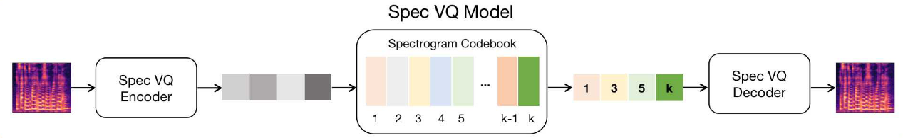
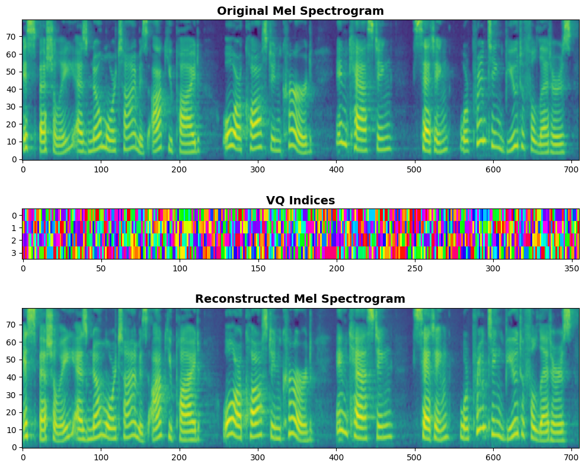

# Spectrogram Vector Quantization

This is an **unofficial implementation** of the Spectrogram VQ module from the DCTTS (Discrete Diffusion Model with Contrastive Learning for Text-to-Speech Generation) paper. DCTTS proposes a novel TTS approach that leverages discrete diffusion models and contrastive learning to generate high-quality speech. This repository specifically implements the Spectrogram VQ component described in Section 2.1 of the paper, which quantizes mel-spectrograms into discrete representations.

<p align="center">
  
  <br>
  <em>Figure 1. Spectrogram VQ architecture from DCTTS paper</em>
</p>

## Environment

- Docker image: `pytorch/pytorch:2.8.0-cuda12.8-cudnn9-devel`
- GPU: NVIDIA RTX 4060 (8GB VRAM)

## Setup

1. Clone this repository and install Python requirements:

   ```bash
   pip install -r requirements.txt
   ```

2. Download the [LJSpeech dataset](https://keithito.com/LJ-Speech-Dataset/) and place it under `/workspace/data/` (recommended)

## How to Run

1. Prepare mel-spectrogram features in `.npy` format:

   ```bash
   python preprocess.py
   ```

2. Train the Spectrogram VQ model:

   ```bash
   python train_vqgan.py
   ```

3. Run inference:

   Open the `inference.ipynb` notebook for inference examples and usage.

## Results

Audio samples can be found in the `sample/` directory. Most hyperparameters follow the VQGAN implementation from [dome272/VQGAN-pytorch](https://github.com/dome272/VQGAN-pytorch).

<div align="center">

<br>
<em>Figure 2. Spectrogram indices visualization</em>
</div>

## Acknowledgements

This implementation builds upon several excellent works:

- **DCTTS Paper**: Wu, Zhichao, et al. "DCTTS: Discrete diffusion model with contrastive learning for text-to-speech generation." _ICASSP 2024-2024 IEEE International Conference on Acoustics, Speech and Signal Processing (ICASSP)_. IEEE, 2024.
- **VQGAN Implementation**: [dome272/VQGAN-pytorch](https://github.com/dome272/VQGAN-pytorch) for the VQGAN architecture reference.
- **HiFi-GAN**: [keonlee9420's HiFi-GAN implementation](https://github.com/keonlee9420/Comprehensive-Transformer-TTS) for the vocoder parameters.
- **Original HiFi-GAN**: [jik876/hifi-gan](https://github.com/jik876/hifi-gan) for the original HiFi-GAN model.

I am grateful to all the authors for making their work publicly available. 👏
